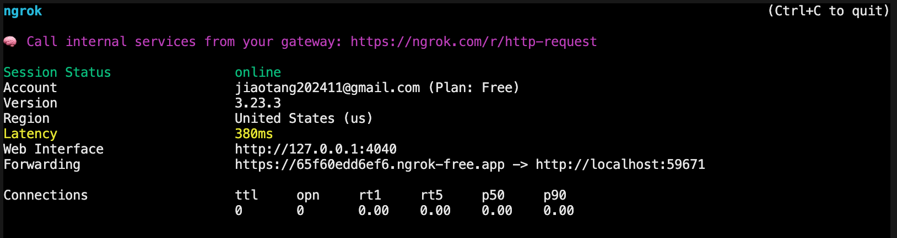

# 📂 本地文件公网访问 - ngrok 教程

> 本教程记录我使用 ngrok 工具，将本地文件/服务快速映射到公网地址的完整过程。无需配置云服务器，也不需要公网 IP。

---

## 📌 应用场景

- 分享本地开发项目或文件给远程朋友或同事
- 调试微信/支付宝等 Webhook 回调接口
- 演示网站或前端页面
- 远程测试接口
- 内网穿透

---

## 🚀 一、ngrok 是什么？

ngrok 是一个反向代理工具，它可以通过在本地运行一个客户端程序，将你本地的 HTTP 服务暴露到公网，从而生成一个临时的公网访问地址。

官方网站：https://ngrok.com/

---

## 📥 二、下载安装步骤

### 1. 注册账户

- 访问 [ngrok 官网](https://ngrok.com/) 注册一个免费账号（用于获取授权 token）

### 2. 下载 ngrok 客户端

- 下载地址：https://ngrok.com/download
- 根据操作系统选择版本（我使用的是 Windows 版本）
- 下载后解压 `ngrok.zip` 到任意目录

### 3. 配置授权 token

登录网站后，在个人中心找到 AuthToken（如 `2K3aNxxxxx....`），执行以下命令绑定：  
⚠️ngrok 需在系统中添加全局 PATH 路径后方可使用。

```bash
ngrok config add-authtoken 你的-auth-token
```

### 🖥️ 4、启动本地服务（以共享文件为例）

通常 python 或者 node 都有可以快速启动静态服务的工具包，node 推荐 serve

```bash
cd 你要共享的文件夹路径
serve
```

启动完成后，本地服务 http://localhost:5000 便可以启动。

### 🌐 三、通过 ngrok 映射到公网

```
进行公网设置：
ngrok http  http://localhost:5000
```

### 📚 四、参考资料

ngrok 官网：https://ngrok.com/

官方文档：https://ngrok.com/docs

### 五、成功案例

```bash
ngrok http  http://localhost:59671
```


